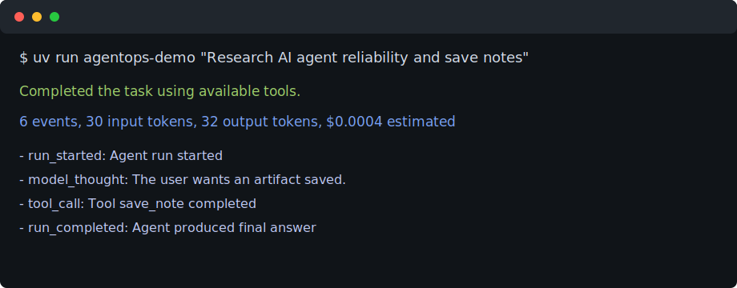

# AgentOps Starter Kit

A small, production-minded Python starter kit for building AI agents that are observable, testable, and easy to extend.

This project is intentionally compact. It demonstrates the engineering pieces most agent demos skip:

- Tool registry with typed inputs and controlled failures
- Agent loop with retry policy and budget limits
- Telemetry for model calls, tool calls, latency, and estimated cost
- Deterministic fake model for tests and local demos
- Optional Ollama provider for local/offline LLM experiments
- Simple eval runner for checking agent behavior before shipping

## Status

This is a demo/MVP project for local experimentation and portfolio learning. It is not production-ready.

- The default demo uses a deterministic fake model, so it works without API keys.
- Ollama support is optional and runs against a local Ollama server on your machine.
- Coding-agent workflows are currently plan-only. They can inspect, run guarded commands, and produce reports, but they do not edit files.
- Do not use this for production automation without adding stronger sandboxing, approvals, persistent logs, and security review.



## Quick Start

```bash
uv sync --extra dev
uv run agentops demo "Summarize revenue.csv and save the result"
uv run pytest
```

The demo uses a deterministic fake model, so it runs without API keys.

Create a guarded AI-agent app:

```bash
uv run agentops init ../my-agent-app
cd ../my-agent-app
uv sync --extra dev
uv run pytest
```

Use a local Ollama model when available:

```bash
ollama serve  # skip this if Ollama is already running
ollama pull llama3.2
uv run agentops demo --provider ollama --model llama3.2 "Plan a support triage agent"
```

Explore a codebase with the guarded local coding-agent workflow:

```bash
uv run agentops code explore .
```

This mode is read-only. It samples the workspace, reports key files and tests, and does not edit code.

Plan a bugfix from a focused test command:

```bash
uv run agentops code bugfix . \
  --task "fix parser failure on empty input" \
  --test "uv run pytest tests/test_parser.py"
```

Bugfix mode is verification-first and currently plan-only. It runs the provided test command, refuses to proceed if the test already passes by default, and prints a structured bugfix plan from the failure output.

Plan a feature from acceptance criteria:

```bash
uv run agentops code feature . \
  --task "add markdown export" \
  --accept "exports a markdown file" \
  --accept "keeps existing tests passing" \
  --test "uv run pytest"
```

Feature mode is acceptance-driven and currently plan-only. It turns criteria into a test/eval-first implementation plan and can run an optional baseline command before planning.

Plan a behavior-preserving refactor:

```bash
uv run agentops code refactor . \
  --task "split parser module into smaller units" \
  --preserve "uv run pytest"
```

Refactor mode requires a passing preservation command before it produces a plan. If the command fails, it blocks the refactor and reports that the baseline must be fixed first.

## Project Layout

```text
agentops-starter-kit/
├── src/agentops_starter/
│   ├── agent.py          # Agent loop, retry policy, budget enforcement
│   ├── coding_agent.py   # Local coding-agent workflows
│   ├── coding_tools.py   # Guarded filesystem and command tools
│   ├── models.py         # Model provider protocol and fake provider
│   ├── scaffold.py       # Guarded project generator
│   ├── telemetry.py      # Run trace, cost, timing, event records
│   ├── tools.py          # Tool registry and example tools
│   └── evals.py          # Lightweight behavior evaluation
├── examples/
│   └── basic_research_agent.py
├── tests/
└── docs/assets/
```

## Why This Exists

Most portfolio agent projects show a prompt and an API call. That is not enough for real work.

This starter kit shows how to wrap an agent with operational guardrails:

- **Reliability:** retries are explicit and bounded.
- **Observability:** every model and tool action becomes a trace event.
- **Cost control:** token/cost estimates are tracked against a budget.
- **Testability:** the fake model makes tests deterministic.
- **Extensibility:** real model providers can implement one protocol.

## Local Coding-Agent Workflows

The coding-agent layer is intentionally guarded and local-first. The first workflow is:

```bash
uv run agentops code explore /path/to/repo
```

It provides a read-only repo summary. The underlying tools enforce:

- workspace path boundaries
- ignored build/cache directories
- allowlisted shell commands
- blocked destructive commands such as hard resets

The second workflow is:

```bash
uv run agentops code bugfix /path/to/repo --task "..." --test "uv run pytest ..."
```

It does not edit files yet. It establishes the bugfix discipline first:

1. run the focused test command
2. confirm the failure is real
3. refuse passing tests unless `--allow-passing` is set
4. produce a small, reviewable fix plan
5. keep all command execution inside the workspace guardrails

The third workflow is:

```bash
uv run agentops code feature /path/to/repo \
  --task "add markdown export" \
  --accept "exports a markdown file"
```

It establishes feature discipline:

1. require explicit acceptance criteria
2. optionally run a baseline test command
3. turn criteria into tests/evals before implementation
4. produce a small, reviewable implementation plan
5. keep execution inside the same local guardrails

The fourth workflow is:

```bash
uv run agentops code refactor /path/to/repo \
  --task "split parser module into smaller units" \
  --preserve "uv run pytest"
```

It establishes refactor discipline:

1. require a behavior-preservation command
2. block when the preservation check fails
3. keep public behavior unchanged unless explicitly requested
4. refactor in small steps
5. rerun the preservation command after meaningful changes

Current limitation:

- Coding workflows are plan-only. They do not edit files yet.
- Write/edit mode should be added only with patch previews, path restrictions, and required verification.

Planned write mode:

- controlled patch application
- dry-run preview
- mandatory post-change test command
- generated change summary

## Local Testing

Run the starter kit checks:

```bash
uv run pytest
uv run ruff check .
uv run ruff format --check .
```

Smoke-test the CLI locally:

```bash
uv run agentops demo "Research AI agent reliability and save notes"
uv run agentops code explore .
uv run agentops code bugfix . --task "fix missing test" --test "uv run pytest missing_test.py"
uv run agentops code feature . --task "add markdown export" --accept "exports markdown"
uv run agentops code refactor . --task "split parser module" --preserve "uv run pytest"
```

## Example

```python
from agentops_starter import Agent, AgentConfig, FakeModelProvider, default_tool_registry

agent = Agent(
    model=FakeModelProvider(),
    tools=default_tool_registry(),
    config=AgentConfig(max_steps=4, budget_usd=0.05),
)

result = agent.run("Research AI agent reliability and save notes")

print(result.final_answer)
print(result.trace.summary())
```

## Adding a Real Model Provider

Implement the `ModelProvider` protocol:

```python
from agentops_starter.models import ModelProvider, ModelRequest, ModelResponse

class OpenAIProvider:
    def complete(self, request: ModelRequest) -> ModelResponse:
        # Call your model API here and map the response into ModelResponse.
        ...
```

Keep provider code behind this interface so the agent loop, tools, telemetry, and tests remain stable.

## Testing

```bash
uv run pytest
uv run ruff check .
uv run ruff format --check .
```
